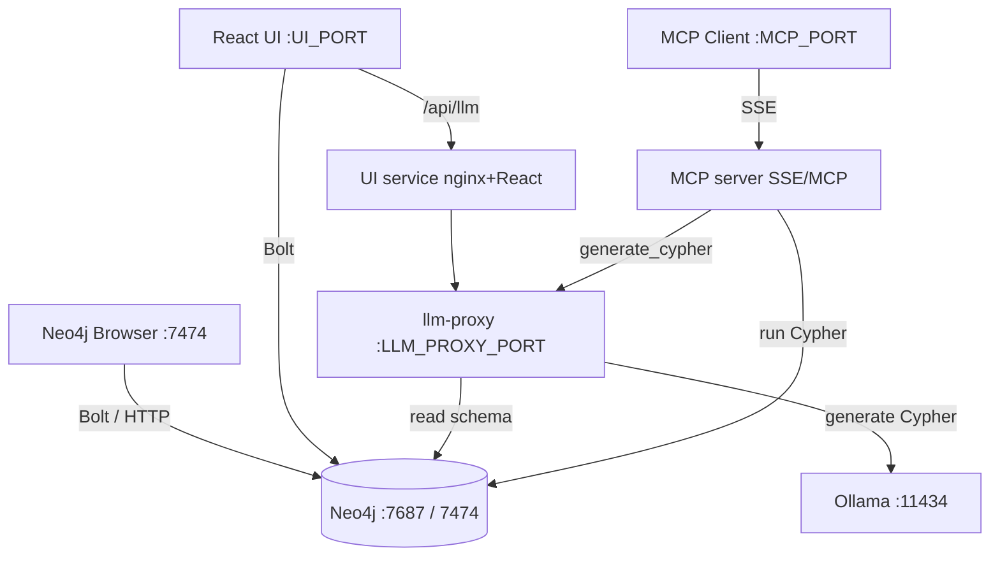

# Neo4j Docker Compose Stack

A production-hardened Docker Compose project with:

- **Neo4j** graph database (Community Edition)
- **Graph Visualization UI** — a React/Cytoscape web app to explore nodes and relationships
- **MCP Endpoint** — a Model Context Protocol server over SSE for AI-driven graph access

## Why I built this

Neo4j already ships with a powerful browser-based GUI on port `7474` for writing and running Cypher directly. I wanted an additional, lightweight web UI that lets me ask questions in plain English and have a local LLM generate the Cypher for me, then render the results as an interactive graph. This project bundles that custom UI with the graph database and an MCP endpoint so an LLM can query Neo4j directly. It also ships with production-hardening defaults — localhost-only ports, non-root containers, read-only filesystems, and runtime configuration — so it is safe to run locally and easy to adapt for a real deployment.

## Quick Start

Copy the example environment file and set strong passwords:

```bash
cp .env.example .env
# edit .env with secure values
docker compose up -d
```

## Architecture



### Service responsibilities

- **Neo4j** stores the graph and exposes Bolt (`7687`) and the Neo4j Browser (`7474`).
- **UI service** serves the React/Cytoscape front end and proxies LLM requests to `llm-proxy`.
- **llm-proxy** reads the Neo4j schema and asks a local Ollama model to translate English questions into Cypher.
- **MCP server** exposes Neo4j resources and tools (including `generate_cypher`) to MCP clients over SSE.

## Services

All services bind to `127.0.0.1` by default so they are not exposed to the network. UI, MCP, and LLM proxy ports can be changed in `.env` via `UI_PORT`, `MCP_PUBLISHED_PORT`, and `LLM_PROXY_PUBLISHED_PORT`.

| Service     | Port | Description |
|-------------|------|-------------|
| `neo4j`     | `NEO4J_BROWSER_PORT` / `NEO4J_BOLT_PORT` | Neo4j Browser (HTTP) and Bolt endpoint |
| `ui`        | `UI_PORT` | React graph visualization UI |
| `mcp`       | `MCP_PUBLISHED_PORT` | MCP server endpoint (SSE) |
| `llm-proxy` | `LLM_PROXY_PUBLISHED_PORT` | Ollama natural-language-to-Cypher proxy |

## Usage

### Neo4j Browser

Open http://localhost:7474 and sign in with the credentials from `.env`.

### Graph Visualization UI

Open http://localhost:3000 (or the port set in `.env` as `UI_PORT`) and run Cypher queries. The default query loads the first 100 `(n)-[r]->(m)` patterns.

Click nodes or edges to inspect their properties. Drag to pan, scroll to zoom.

### Natural Language to Cypher

The UI can translate plain-English questions into Cypher queries using a local Ollama instance.

1. Install and start Ollama on the host (or wherever you prefer) on port `11434`.
2. Pull a model, for example:
   ```bash
   ollama pull qwen2.5-coder:7b
   ```
3. Ensure `.env` points at it:
   ```env
   OLLAMA_HOST=http://host.docker.internal:11434
   OLLAMA_MODEL=qwen2.5-coder:7b
   ```
4. Restart the stack if you changed `.env`.
5. In the UI, open the **Chat** panel and type a question such as `show me all people who work at Neo4j`. The generated Cypher appears in the chat; click **Run Cypher** to execute it.

You can also use the `generate_cypher` MCP tool to translate English questions into Cypher from any MCP client. Both the UI chat and `generate_cypher` require the `llm-proxy` service to be healthy and Ollama to be reachable at `OLLAMA_HOST`.

### MCP Endpoint

The MCP server is available at `http://localhost:3001` (or the port set in `.env`) using SSE transport.

- **SSE stream:** `GET http://localhost:3001/sse`
- **Messages:** `POST http://localhost:3001/messages?sessionId=<sessionId>`

Resources exposed:

- `neo4j://schema` — labels, relationship types, property keys
- `neo4j://labels` — node labels
- `neo4j://relationship-types` — relationship types
- `neo4j://nodes/{label}` — sample nodes for a label
- `neo4j://node/{id}` — node by internal Neo4j identity

Tools exposed:

- `run_cypher` — run a read-only Cypher query
- `generate_cypher` — translate an English question into Cypher via the LLM proxy
- `get_neighbors` — get neighbors of a node
- `get_shortest_path` — shortest path between two nodes

## Sample Data

Open Neo4j Browser at http://localhost:7474 and run:

```cypher
CREATE (a:Person {name: 'Alice', age: 30})
CREATE (b:Person {name: 'Bob', age: 28})
CREATE (c:Person {name: 'Carol', age: 32})
CREATE (a)-[:KNOWS {since: 2020}]->(b)
CREATE (b)-[:KNOWS {since: 2021}]->(c)
CREATE (c)-[:KNOWS {since: 2022}]->(a)
```

Then visit http://localhost:3000 (or the `UI_PORT` from `.env`) to visualize the graph.

## Production Hardening

The stack applies the following hardening by default:

- **Localhost binding:** all ports are bound to `127.0.0.1`, not `0.0.0.0`.
- **Read-only containers:** the UI and MCP containers run with read-only root filesystems.
- **Non-root execution:** the UI and MCP services run as unprivileged users.
- **Capability drop:** all Linux capabilities are dropped for UI and MCP.
- **Security headers:** UI responses include HSTS-style headers via nginx and Helmet.
- **Runtime configuration:** the UI reads Neo4j credentials from container env vars at startup, so they are not baked into the image.
- **Cypher sandbox:** MCP `run_cypher` rejects write keywords; resources sanitize labels and IDs.
- **Query guardrails:** MCP caps record counts, applies query timeouts, and validates input types.
- **Rate limiting:** the MCP endpoint limits requests per IP.
- **CORS:** the MCP server only allows configured origins; by default cross-origin browser requests are rejected.

## Environment Variables

Copy `.env.example` to `.env` and configure at minimum:

```env
NEO4J_AUTH=neo4j/<strong-password>
NEO4J_PASSWORD=<strong-password>
```

Full environment variable reference:

```env
# Neo4j credentials in USERNAME/PASSWORD format.
NEO4J_AUTH=neo4j/CHANGE_ME_TO_A_STRONG_PASSWORD
# Plain-text password used by the UI, MCP, and LLM proxy. Must match NEO4J_AUTH.
NEO4J_PASSWORD=CHANGE_ME_TO_A_STRONG_PASSWORD

# Neo4j resource limits.
NEO4J_HEAP_SIZE=1G
NEO4J_MEMORY_LIMIT=2G

# Host ports exposed on the Docker host.
NEO4J_BROWSER_HOST=127.0.0.1
NEO4J_BROWSER_PORT=7474
NEO4J_BOLT_HOST=127.0.0.1
NEO4J_BOLT_PORT=7687

# Bolt URI the browser UI uses to reach Neo4j.
NEO4J_UI_URI=bolt://localhost:7687

# MCP tuning.
MCP_MAX_RECORDS=100
MCP_QUERY_TIMEOUT_MS=30000
MCP_ALLOWED_ORIGINS=

# Published host ports.
UI_HOST=127.0.0.1
UI_PORT=3000
MCP_HOST=127.0.0.1
MCP_PUBLISHED_PORT=3001
LLM_PROXY_PUBLISHED_PORT=3005

# Ollama configuration for the natural-language-to-Cypher proxy.
OLLAMA_HOST=http://host.docker.internal:11434
OLLAMA_MODEL=qwen2.5-coder:7b
```

## Testing

A basic smoke test is provided in `scripts/smoke-test.sh`. It validates the Compose file, starts the stack, waits for all services to become healthy, and checks the public health endpoints:

```bash
./scripts/smoke-test.sh
```

## Development

Run the UI locally for faster iteration:

```bash
cd ui
npm install
npm run dev
```

Run the MCP server locally:

```bash
cd mcp-server
npm install
NEO4J_URI=bolt://localhost:7687 NEO4J_PASSWORD=<password> npm start
```

## Stop and Clean Up

```bash
docker compose down
```

To remove persisted data:

```bash
docker compose down
rm -rf data logs
```

## License

This project is licensed under the MIT License — see the [LICENSE](LICENSE) file for details.
